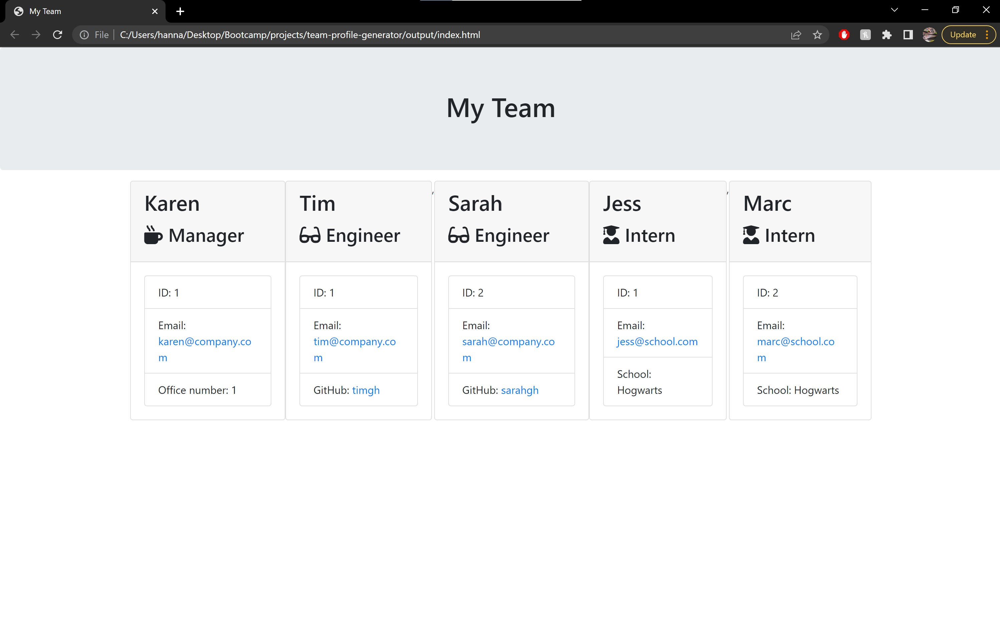

# Title: Team Profile Generator
## Table of Contents

[Description](#description)

[Links](#links)

[Display](#display)

[Installation](#installation)

[Usage](#usage)

[Licenses](#licenses)

[Contribution](#contribution)

[Contact](#contact)

### Description
Generates an html file which displays the members of a team along with their specific roles.
Picture of the application:

### Links
Github Link: https://github.com/hannahisprogramming/team-profile-generator

### Display

### Installation
Node.js

### Usage
Personal

### Licenses

### Contribution
Anyone

### Contact
Developer's Name: Hannah Bush
Developer's Profile (https://github.com/hannahisprogramming)
Developer's Email: <heb.rutgers@gmail.com>